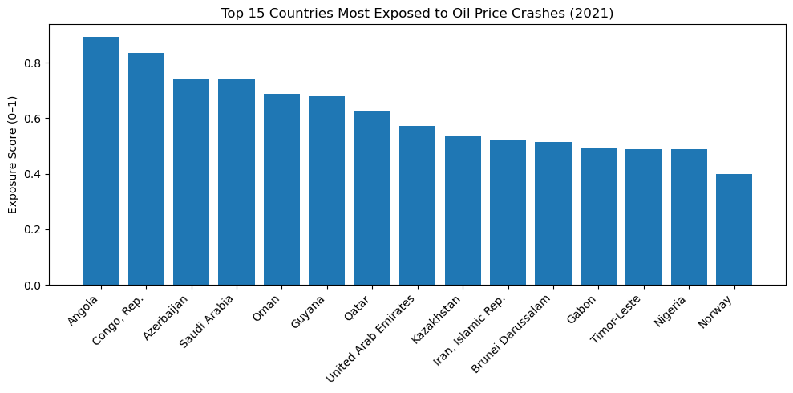
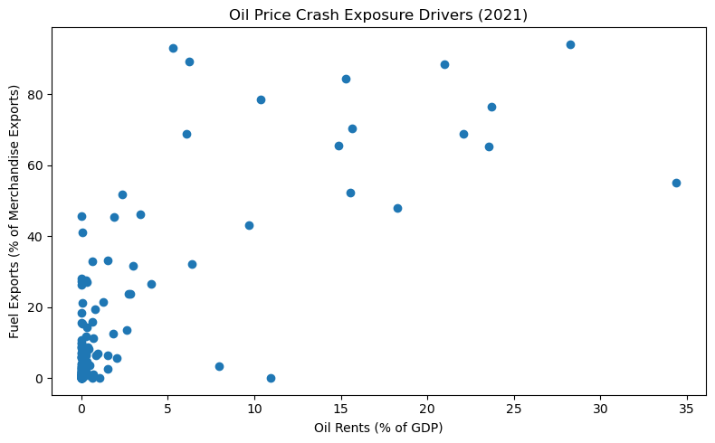
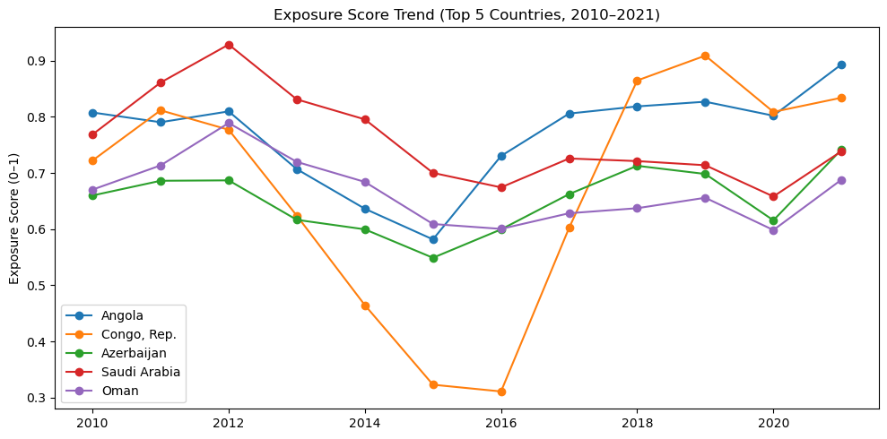

# Oil Price Crash Exposure by Country (2010–2023)

## 📌 Business Problem
Oil price crashes can severely impact countries that depend heavily on oil exports and petroleum revenues. 

When global oil prices decline sharply (e.g., 2014–2016 crash, 2020 COVID shock), 

oil-dependent economies often experience:

- Revenue shortfalls
- Fiscal pressure
- Currency depreciation
- Economic contraction

This project answers the key question:

**Which countries are most exposed to oil price crashes between 2010 and 2023?**


## 🎯 Objective

To identify and rank countries based on structural exposure to oil price volatility using economic dependence indicators.

The analysis focuses on:
- Oil rents as % of GDP
- Fuel exports as % of merchandise exports
- Exposure score trends over time
- Sensitivity during major oil price crash periods


# 📂 Data Sources

Data was obtained via the World Bank API, including:

1. Oil rents (% of GDP)
`Indicator: NY.GDP.PETR.RT.ZS`

2. Fuel exports (% of merchandise exports)
`Indicator: TX.VAL.FUEL.ZS.UN`

3. Historical Brent oil price data (for contextual crash analysis)

**Time period analyzed:**
2010–2023

## Tools Used
- Python
- Pandas
- NumPy
- Matplotlib / Seaborn
- World Bank API

## 🧹 Data Cleaning & Preparation (Python)

##### Steps performed:

- Pulled data using World Bank API (JSON format)
- Converted JSON to Pandas DataFrame
- Removed regional aggregates:
  - World
  - Income groups
  - Regional codes (e.g., AFE, EUU)
- Filtered years: 2010–2023
- Removed missing values
- Merged oil rent and fuel export datasets (inner join)


## 📊 Exposure Score Construction
To measure vulnerability, an Exposure Score was constructed by combining:
- Oil rents (% of GDP)
- Fuel exports (% of merchandise exports)

The exposure score was normalized to range between 0 and 1.

Conceptually:

```Exposure Score = f(Oil Rent Dependency + Export Dependency)```

Higher scores indicate greater vulnerability to oil price crashes.


## 📈 Analysis & Visualizations

#### 1️⃣ Top 10 Most Exposed Countries (Average 2010–2023)



This visualization ranks countries by average exposure score.

### Key Findings
- Angola and Congo (Rep.) consistently rank among the most exposed.
- Saudi Arabia and Oman show structurally high dependence.
- Exposure in these economies is persistent, not temporary.
- Oil dependence appears embedded in fiscal and export structures.

#### 2️⃣ Oil Price Crash Exposure Drivers




**Key insights:**

**1. Countries in the top-right corner are the most vulnerable.**

These countries have both:
- High oil rents as a share of GDP (their economies depend on oil), and
- High fuel exports as a share of total exports (their foreign currency depends on oil).
This combination makes them highly exposed to oil price crashes because both government revenue and export earnings fall when oil prices decline.

**2. Some countries show high export dependence but lower GDP dependence.**
   
These appear high on the vertical axis but more to the left horizontally.
This suggests that while oil dominates their exports, it is not the main driver of their entire economy. These countries face strong foreign exchange risk during oil price crashes even if GDP impact is smaller.

**3. Some countries have high GDP dependence but more diversified exports.**
   
These appear far to the right but lower vertically.
This indicates that oil contributes heavily to domestic income, but exports are more diversified. These countries are vulnerable through fiscal and budget channels rather than trade channels.

**4. Most countries cluster in the lower-left region.**
   
This cluster represents countries with:
- Low oil rents in GDP, and
- Low fuel export shares.
These economies are relatively insulated from oil price crashes and are more resilient to oil market volatility.

**5. The scatter shows that exposure is driven by two different mechanisms.**
   
The chart demonstrates that vulnerability to oil price crashes is not caused by one factor alone. Instead, risk arises from:
- Dependence on oil for national income (GDP channel), and
- Dependence on oil for export revenue (trade channel).
Countries that score high on both dimensions face the greatest macroeconomic risk.


Countries that rely heavily on oil for both economic output and export earnings face the greatest vulnerability to oil price crashes, while countries with diversified economies and exports are far more resilient.


#### 3️⃣ Exposure Score Trend Over Time



##### Exposure Score Trend (Top 5 Countries, 2010–2021)
**Key insights:**

**1. All five countries remain consistently highly exposed over the entire period.**
Their exposure scores stay mostly above 0.6, indicating that oil dependence is structural, not temporary. These economies have not significantly diversified away from oil during this period.

2. **Saudi Arabia shows the highest exposure in the early 2010s, followed by a gradual decline.**
Exposure peaks around 2012–2013 and then trends downward, suggesting some reduction in oil dependence over time, possibly linked to diversification efforts and economic reforms.

3. **Congo (Rep.) exhibits the most volatility in exposure.**
Its exposure score drops sharply **between 2013 and 2016**, then rebounds strongly after 2017. This suggests that its vulnerability is highly sensitive to changes in oil production levels and export structure.

4. **Angola’s exposure declines after 2012 but rises again after 2016.**
This pattern indicates periods of partial diversification followed by renewed dependence, showing that progress in reducing exposure has not been sustained.

5. **Azerbaijan and Oman show moderate but persistent exposure levels.**
Their exposure scores fluctuate within a narrower band, suggesting gradual adjustments rather than abrupt structural changes in oil dependence.

6. **The period around 2014–2016 coincides with the global oil price crash and is associated with declining exposure for several countries.**
This likely reflects reduced oil rents and export values during the crash, which temporarily lowered measured exposure rather than indicating true economic diversification.

Despite fluctuations linked to oil price cycles, the most exposed countries have remained structurally dependent on oil between 2010 and 2021, with only limited evidence of sustained diversification.

## Overall Findings

Oil exposure remains structurally embedded in several exporting economies.

Export dependency amplifies vulnerability beyond domestic production reliance.

Exposure varies significantly across oil-producing countries.

Diversification reduces long-term vulnerability.

Oil price crashes disproportionately impact fiscally dependent economies.


## Limitations
**1. Exposure score is based on two indicators and does not capture:**
- Sovereign wealth fund buffers
- Debt levels
- Exchange rate regimes
- Fiscal policy responses

**2. Oil rents as % of GDP may fluctuate due to:**
- Price effects
- Production changes

**3. Data availability varies across countries and years.**
   
**4. 2023 data may be provisional.**
   
**5. The analysis does not model macroeconomic outcomes (e.g., GDP contraction), only structural exposure.**


## Conclusion
Between 2010 and 2023, oil price crash exposure remains highly concentrated in a group of structurally oil-dependent economies.
Countries such as Angola, Congo (Rep.), Saudi Arabia, and Oman display sustained vulnerability due to high fiscal and export reliance on oil.
While some economies show modest diversification trends, structural dependence remains a defining characteristic of several exporters.

**Understanding exposure levels is critical for:**
- Risk assessment
- Fiscal planning
- Sovereign credit analysis
- Energy transition strategy

As global energy markets evolve and transition dynamics accelerate, oil-dependent economies face increasing structural risk unless diversification efforts intensify.

